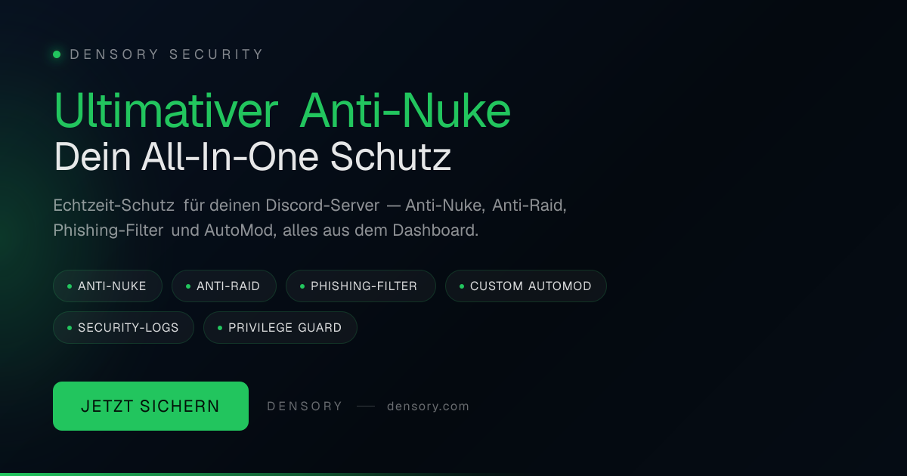

# Densory Security — Security & Moderation

 

> Schützt deine Community rund um die Uhr — bevor ein kompromittierter Admin oder eine Raid-Welle deinen Server zerstört.

Densory Security reagiert in Echtzeit auf gefährliche Massenaktionen, stoppt Raids bevor sie eskalieren und filtert betrügerische Links automatisch. Alles steuerst du bequem im Dashboard — von Anti-Nuke über Quarantäne bis zu AutoMod und Moderations-Logs.

### 🛒 Im Densory-Shop erhältlich

**[Densory Security — Im Shop ansehen](https://densory.com/shop/densory-security)**

## Funktionen

- **Anti-Nuke** — Erkennt Massen-Banns, Kanal- und Rollen-Löschungen in Sekunden — reagiert automatisch.
- **Anti-Raid** — Join-Rate-Erkennung, Account-Alter-Check und Quarantäne — Raids stoppen bevor sie eskalieren.
- **Phishing-Filter** — Domain-Blocklists, Scam-Regex und Link-Schutz — betrügerische URLs werden entfernt.
- **Custom AutoMod** — Keywords, Regex und Bild-OCR — Strikes mit Eskalations-Ladder für faire Moderation.
- **Security-Logs** — 13 Event-Typen per Webhook — jede Mod-Action und Server-Änderung nachvollziehbar.
- **Privilege Guard** — Überwacht sensible Rollen-Rechte — Alert, Revert oder Rollen entziehen bei Eskalation.

## Voraussetzungen

- Discord-Server mit Administratorrechten für den Bot
- Bot-Rolle hoch in der Rollen-Hierarchie platzieren
- Optional: eigener Log-Kanal für Security-Meldungen

## Einrichtung

1. **Bot einladen & Rolle setzen**
   Lade Densory Security ein und platziere die Bot-Rolle über deinen Moderations-Rollen.
2. **Schutzregeln aktivieren**
   Wähle im Dashboard deine Anti-Nuke- und Anti-Raid-Einstellungen — empfohlene Defaults helfen beim Start.
3. **Server absichern**
   Aktiviere Phishing-Schutz, AutoMod-Regeln und Log-Kanäle für volle Transparenz.
4. **Live gehen**
   Beobachte die ersten Security-Logs und passe die Regeln an deine Community an.

## Konfiguration

Die vollständige Einstellungs-Referenz findest du in [docs/configuration.md](docs/configuration.md).

## Changelog

Siehe [CHANGELOG.md](CHANGELOG.md) und den GitHub-Releases-Tab für die vollständige Versions-Historie.

## Support & Links

- 🛒 [Shop](https://densory.com/shop/densory-security)
- 💬 [Discord](https://densory.com/discord)
- ⚙️ [Control Center](https://densory.com/dashboard)

---

_Verwaltet mit dem Densory Control Center: [https://densory.com/dashboard](https://densory.com/dashboard). Erhältlich unter [https://densory.com/shop/densory-security](https://densory.com/shop/densory-security)._
