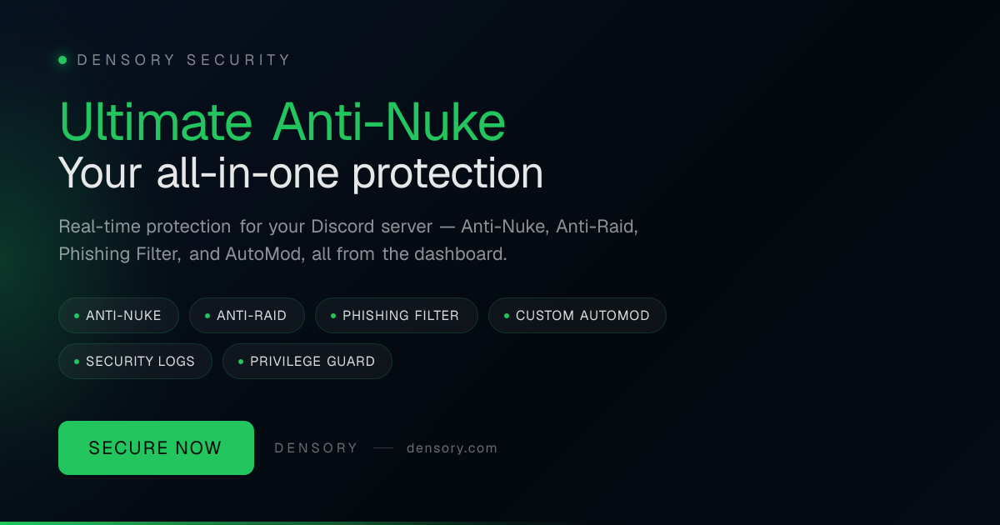

# Densory Security — Security & Moderation

 

> Protect your community around the clock — before a compromised admin or raid wave destroys your server.

Densory Security reacts in real time to dangerous mass actions, stops raids before they escalate and automatically filters fraudulent links. You can control everything conveniently in the dashboard — from anti-nuke and quarantine to AutoMod and moderation logs.

### 🛒 Get it on the Densory Shop

**[Densory Security — View in Shop](https://densory.com/shop/densory-security)**

## Features

- **Anti-Nuke** — Detects mass bans, channel and role deletions in seconds — reacts automatically.
- **Anti-Raid** — Join Rate Detection, Account Age Check, and Quarantine — Stop raids before they escalate.
- **Phishing filter** — Domain blocklists, scam regex, and link protection — fraudulent URLs are removed.
- **Custom AutoMod** — Keywords, regex and image OCR — strikes with escalation ladder for fair moderation.
- **Security Logs** — 13 event types via webhook — every mod action and server change traceable.
- **Privilege Guard** — Monitors sensitive role privileges — alert, revert, or revoke roles in case of escalation.

## Prerequisites

- Discord server with administrator privileges for the bot
- Place the bot role high in the role hierarchy
- Optional: separate log channel for security messages

## Setup

1. **Invite Bot & Set Role**
   Invite Densory Security and place the bot role on top of your moderation roles.
2. **Enable protection rules**
   In the dashboard, select your anti-nuke and anti-raid settings — recommended defaults will help you get started.
3. **Secure your server**
   Enable phishing protection, AutoMod rules, and log channels for full visibility.
4. **Go Live**
   Observe the first security logs and adapt the rules to your community.

## Configuration

See the full settings reference in [docs/configuration.md](docs/configuration.md).

## Changelog

See [CHANGELOG.md](CHANGELOG.md) and the GitHub Releases tab for the full version history.

## Support & Links

- 🛒 [Shop](https://densory.com/shop/densory-security)
- 💬 [Discord](https://densory.com/discord)
- ⚙️ [Control Center](https://densory.com/dashboard)

---

_Managed with the Densory Control Center: [https://densory.com/dashboard](https://densory.com/dashboard). Available at [https://densory.com/shop/densory-security](https://densory.com/shop/densory-security)._
